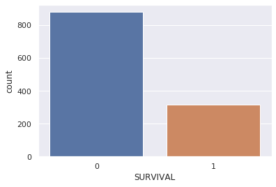

# Machine Learning: USS Indianapolis Survival Exploration

Tasked with the top secret mission of delivering what would become the most important package of ending WWII, the USS Indianapolis left San Francisco on July 16, 1945. Traveling through Pearl Harbor, the very symbol of America's involvement of the conflict, the ship and its nearly 1200 personnel arrived on the small Mariana Island of Tinian supplying the Enola Gay with the "Little Boy": the atomic weapon that would be dropped on Hiroshima in a mere weeks time. Unbeknownst to anyone, the USS Indianapolis too would suffer its own catastrophic demise.         

### Software and Libraries
This project utilizes the following software and Python libraries:
* Python 3.7
* NumPY
* Pandas
* Matplotlib
* Jupyter Notebook/Google Colab

### Introduction:
This project attempts to predict the survival outcomes from the sinking of the USS Indianapolis in 1945. The data that I was able to obtain will allow the study to focus on the rank, pay grade, and status of a soldier based on their enlistment or commission. 

I would like to thank [USSIndianapolis.org](https://www.ussindianapolis.org/intro.htm) for preserving the memory of all the servicemembers who were aboard the USS Indianapolis. Their detailed [dataset](https://www.ussindianapolis.org/crew.htm) allowed for this project to happen.

### Definitions:
* __LAST__: The last name of the individual
* __FIRST__: The first name of the individual
* __ROLE__: The abbreviated specific role of the servicemember (see [here](https://www.cem.va.gov/CEM/docs/abbreviations/Ranks_Navy.pdf) US Navy rank abbreviations)
* __PAY GRADE__: The level of pay according to each person's role
  * An _E-grade_ was for servicemembers in the enlisted rank
  * An _O-grade_ was for servicemembers in the commissioned rank
  * According to [Navy.com](https://www.navycs.com/charts/1942-military-pay-chart.html), E-1 represents the highest paid rank for enlisted members, while O-1 is the lowest for commissioned members.
* __RANK__: The general category for enlisted vs commissioned personnel
* __SURVIVAL__: Outcome of survival (0 = Not Survived, 1 = Survived)

### Decision Functions
* Total Number of Survivors (0 = "Not Survived", 1 = "Survived")
```python
sns.countplot(x = 'SURVIVAL', data = uss)
```

* Percentage of Survival Rate Based on Rank
```python
uss.groupby('RANK')[['SURVIVAL']].mean()*100
```

