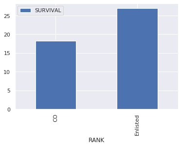
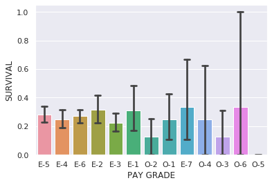

# Machine Learning: USS Indianapolis Survival Exploration (In Progress)

Tasked with the top secret mission of delivering what would become the most important package of ending WWII, the USS Indianapolis left San Francisco on July 16, 1945. Traveling through Pearl Harbor, the very symbol of America's involvement of the conflict, the ship and its nearly 1200 personnel arrived on the small Mariana Island of Tinian supplying the Enola Gay with the "Little Boy": the atomic weapon that would be dropped on Hiroshima in a mere weeks time. Unbeknownst to anyone, the USS Indianapolis too would suffer its own catastrophic demise.         

### Software and Libraries
This project utilizes the following software and Python libraries:
* Pandas
* Numpy
* Matplotlib
* Scikit Learn
* Jupyter Notebook
* Yellowbrick

### Introduction:
This project attempts to predict one's survival aboard the USS Indianapolis. By training a dataset containing the crew members in various machine learning techniques, determining sigificant parameters for survival is the desired outcome.

I would like to thank the [USS Indianapolis CA-35 Legacy Organization](https://www.ussindianapolis.org/) for preserving the memory of all the service members who were aboard the USS Indianapolis. I hope this project lives up to the 

### Data:
The initial data with full list of first names, last names, role, and survival of each crew member was supplied by the USS Indianapolis CA-35 Legacy Organization. I am grateful for their generosity in sharing these records.

The birth years and states for the crew members were wraggled from [HonorStates.org](https://www.honorstates.org/) or local newspaper obituaries.

### Definitions:
* __LAST__: The last name of the individual
* __FIRST__: The first name of the individual
* __ROLE__: The abbreviated specific role of the service member (see [here](https://www.cem.va.gov/CEM/docs/abbreviations/Ranks_Navy.pdf) US Navy rank abbreviations)
* __PAY GRADE__: The level of pay according to each person's role
  * An _E-grade_ was for service members in the enlisted rank
  * An _O-grade_ was for service members in the commissioned rank
  * According to [Navy.com](https://www.navycs.com/charts/1942-military-pay-chart.html), E-1 represents the highest paid rank for enlisted members, while O-1 is the lowest for commissioned members.
* __RANK__: The general category for enlisted vs commissioned personnel
* __LS__: Outcome of survival (0 = Lost at Sea, 1 = Survived)

### Decision Functions
* Total Number of Survivors (0 = "Not Survived", 1 = "Survived")
```python
uss['LS'].value_counts()
sns.countplot(x = 'LS', data = uss)
```
| Total	| 1195 |
| --- | ---:|
| Survived  |	315 |
| Not Survived  | 880 |


* Percentage of Survival Rate Based on Rank
```python
percentage = uss.groupby('RANK')[['LS']].mean()*100
percentage.plot(kind = 'bar')
```
                                                                                                                      
| Rank	| Survival % | 
| --- | ---:|
| CO  |	18.292683 |
| Enlisted |	26.954178 |



* Percentage of Survival Rate Based on Pay Grade
```python
pay_grade = uss.groupby('PAY GRADE')[['LS']].mean()*100
sns.barplot(x='PAY GRADE', y="SURVIVAL", data= uss_df, capsize=.3)
```
| Pay Grade	| Survival % |
| --- | ---:|
| E-1 |	31.03 |
| E-2	| 31.63 |
| E-3	| 22.42 |
| E-4 |	24.72 |
| E-5 |	28.30 |
| E-6	| 27.37 |
| E-7 |	33.33 |
| O-1 |	25.00 | 
| O-2 |	12.50 |
| O-3 |	12.50 |
| O-4 |	25.00 |
| O-5 |	0.00 |
| O-6 |	33.33 |



The black vertical bars show each pay grade's standard deviation.


***This project is a work in progress. Any feedback is more than welcome. 
